# Pràctica: Analitzador de protocols Wireshark

## Configuracions inicials

Per fer aquesta pràctica necessitem el Kali Linux amb Wireshark instal·lat i la targeta de xarxa configurada en mode pont amb les següents dades:

- IP: `192.168.4.26/24`
- Porta d'enllaç: `192.168.4.254`
- DNS: `8.8.8.8`

Accedim a la configuració de xarxa i configurem l'adaptador manualment:

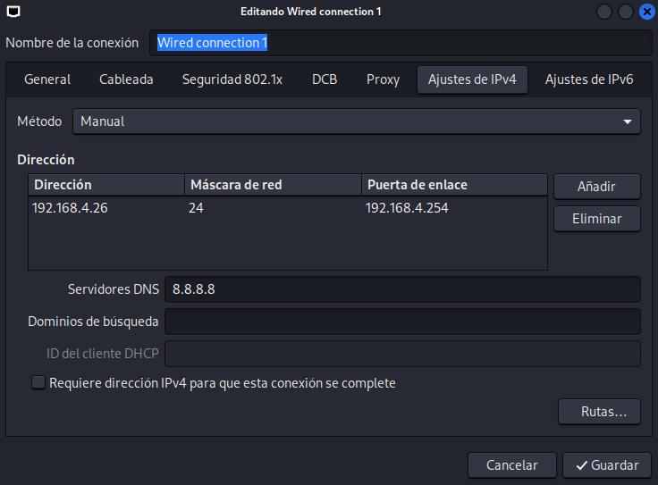

---

## 1. Anàlisi en viu

### 1.1 ICMP

Iniciem la captura a Wireshark sobre la targeta `eth0` i executem un ping al gateway des d'un terminal:

```bash
ping 192.168.4.10
```

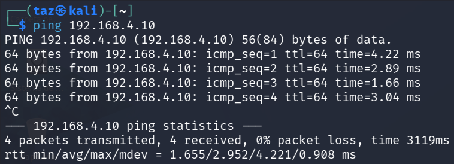

Aturem la captura i apliquem el filtre `icmp`. Podem veure els paquets Echo request i Echo reply:

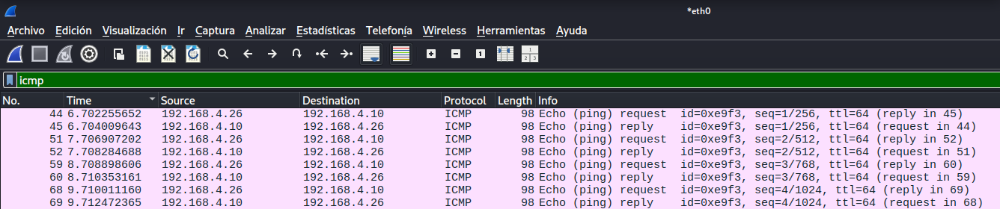

Cliquem sobre el paquet `Echo request` i despleguem la secció `Internet Control Message Protocol` al panell inferior. Podem veure que el tipus és `8`:

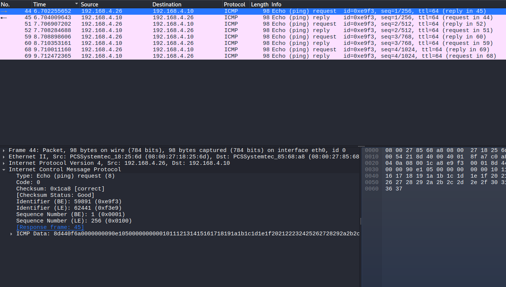

Cliquem sobre el paquet `Echo reply` i veiem que el tipus és `0`:

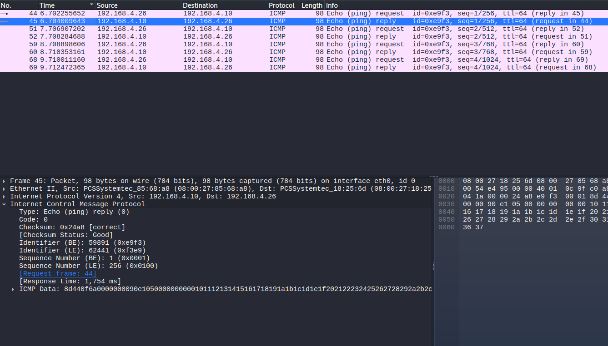

### Pregunta

1. Quin número de tipus de ICMP té la petició d'eco i quin la resposta d'eco? Com ho veus?

El tipus ICMP de la petició d'eco (Echo request) és el `tipus 8` i el de la resposta d'eco (Echo reply) és el `tipus 0`.

---

### 1.2 Mode promiscu

Activem el mode promiscu a la configuració de la targeta de xarxa del VirtualBox seleccionant `"Permet-ho tot"`:

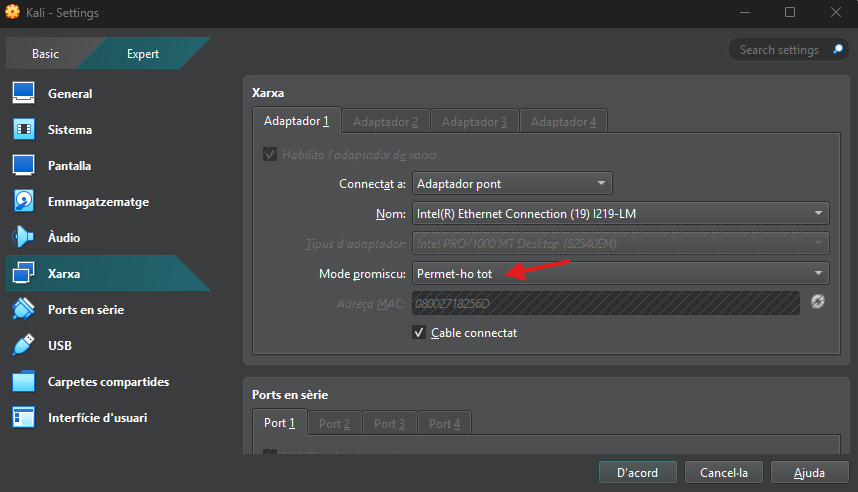

### Pregunta

1. Fes una captura de trànsit, mentre navegues des de la màquina física. Quin trànsit pots veure relacionat amb el teu PC?

Iniciem una nova captura i naveguem des del PC físic. Podem veure tràfic de tota la xarxa, incloent paquets DNS de la navegació des del PC físic, pel que podem veure l'accés que s'ha fet a la `Wikipedia`:

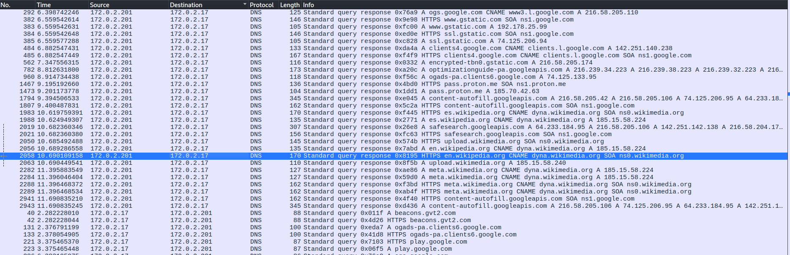

---

### 1.3 DNS

Apliquem el filtre `dns and ip.addr == 192.168.4.26` i executem una consulta DNS:

```bash
nslookup www.xtec.cat
```

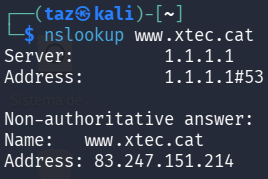

Podem veure els dos paquets DNS: la petició (query) i la resposta (response):

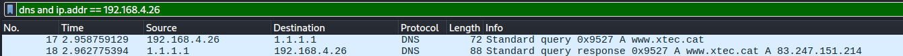

Cliquem sobre el paquet `response` i despleguem la secció `Answers`. Veiem que l'adreça IP de `www.xtec.cat` és `83.247.151.214`, que coincideix amb la del `nslookup`:

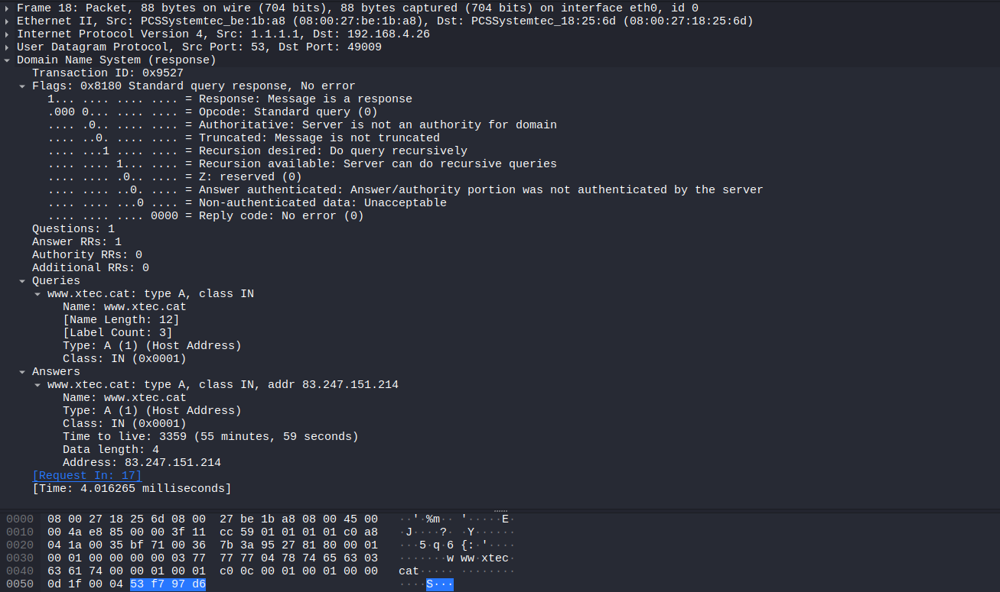

---

### 1.4 ARP

Apliquem el filtre `arp` i executem un ping al gateway per generar tràfic ARP.

```bash
ping -c 1 192.168.4.254
```

Podem veure la petició (Who has 192.168.4.254?) i la resposta:

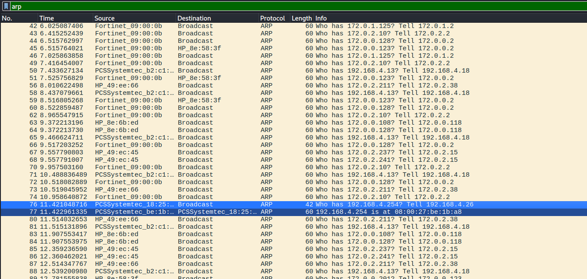

### Pregunta

1. Quina adreça MAC té el gateway de la xarxa? Quin és el fabricant de la seva NIC?

La MAC del gateway (192.168.4.254) és `08:00:27:be:1b:a8`. El fabricant és `PCS Systemtechnik GmbH` (VirtualBox), tal com es pot veure a la columna Source amb el prefix `PCSSystemtec`.

---

## 2. Anàlisi de captures. Arxius

Descarreguem els fitxers `captura1.pcapng` i `captura2.pcapng` del repositori i els obrim des de `Archivo → Abrir`:

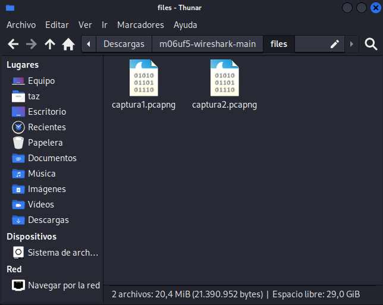

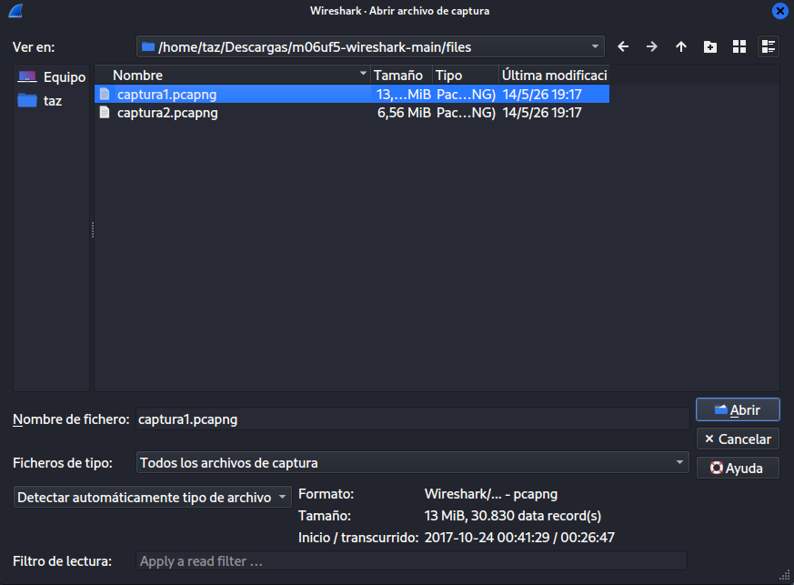

---

### 2.1 ARP — captura1.pcapng

Apliquem el filtre `arp and arp.src.proto_ipv4 == 192.168.1.1` per veure els paquets ARP de l'equip amb IP `192.168.1.1`:

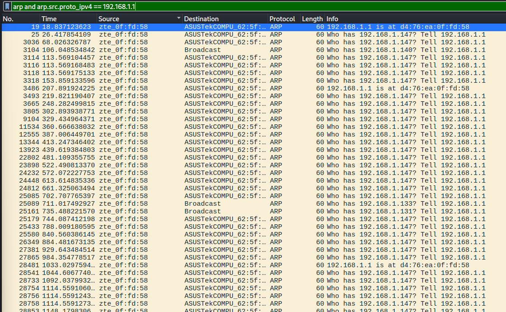

### Pregunta

1. Pots saber quina adreça MAC té l'equip amb adreça 192.168.1.1?

La MAC de l'equip amb IP 192.168.1.1 és `d4:76:ea:0f:fd:58`.

---

### 2.2 FTP — captura1.pcapng

Apliquem el filtre `ftp` per veure la sessió FTP:

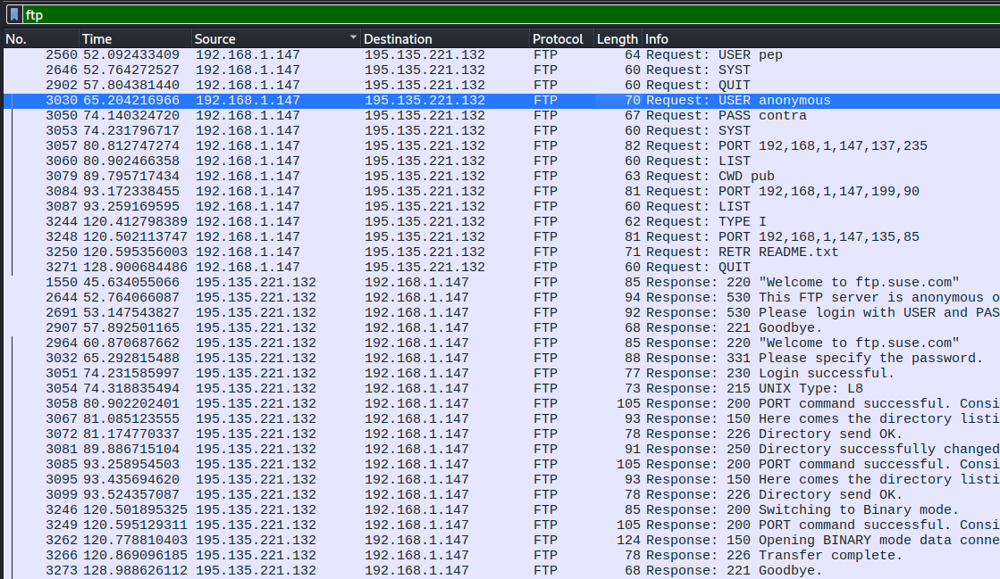

### Pregunta

1. Quin és el password de l'usuari que inicia sessió? Quin nom té el fitxer que es descarrega del servidor?

- `Usuari:` anonymous
- `Contrasenya:` contra (visible en text clar al paquet `PASS contra`)
- `Fitxer descarregat:` README.txt

---

### 2.3 Telnet — captura1.pcapng

Apliquem el filtre `telnet`:

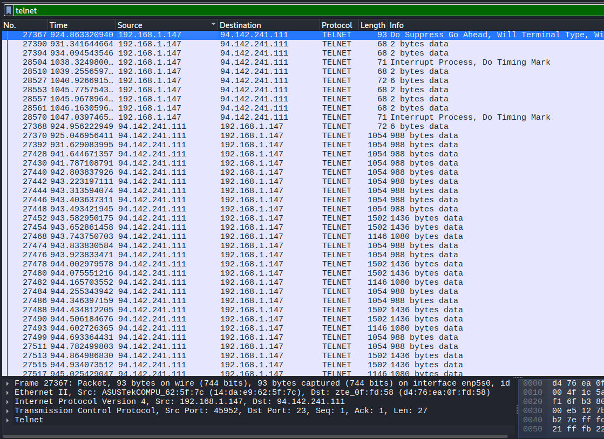

I fem clic dret sobre un paquet → `Seguir → Flujo TCP`:

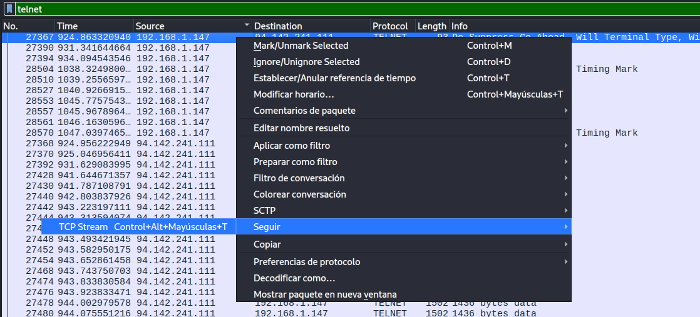

Podem veure el contingut de la sessió en text clar, on es veu que s'ha iniciat una sessió Telnet a `towel.blinkenlights.nl` i s'està visualitzant una animació ASCII de Star Wars:

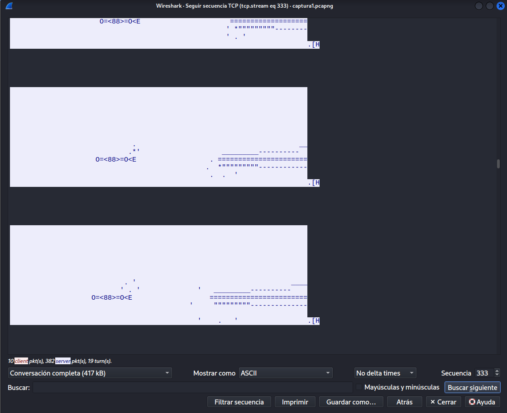

### Pregunta

1. Pots veure el que veia l'usuari en connectar al telnet? Explica què és. Quins caràcters composen la nau espacial petita (posar com a resposta)?

En connectar al telnet es veu que s'ha iniciat una sessió a `towel.blinkenlights.nl` i s'està visualitzant una `animació ASCII de Star Wars` on s'observa una `Nau espacial petita`, composada pels següents caràcters:

```
O=<88>=O<E
```

2. A quin domini pertany l'adreça on ens connectem?

El Domini de la IP destí (94.142.241.111), pertany a `towel.blinkenlights.nl`.

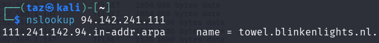

---

### 2.4 SSH — captura1.pcapng

Apliquem el filtre `ssh and frame.len == 326` per trobar el paquet de 326 bytes:

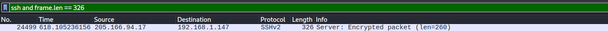

Cliquem sobre el paquet i veiem les dades xifrades al panell inferior:

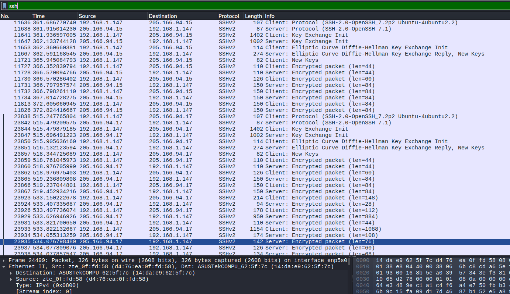

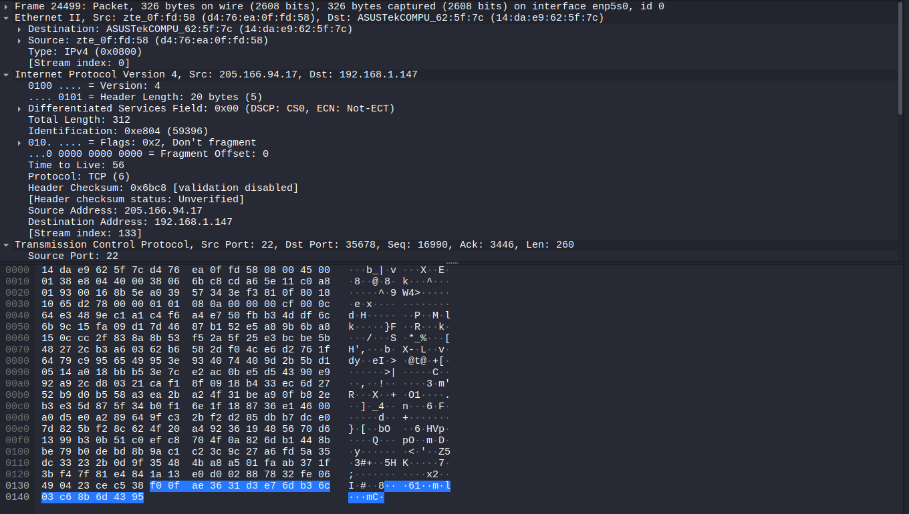

### Pregunta

1. Pots saber a quin domini pertany l'adreça del servidor?

No podem saber al domini que pertany l'adreça del servidor SSH, ja que els paquets SSH estan xifrats i no contenen informació de domini en text clar. Només podem veure les adreces IP dels servidors SSH, que són `205.166.94.15` i `205.166.94.17`.

2. Pots veure el contingut de les dades de la sessió? Enganxa les dades que conté el paquet ssh de longitud total 326 bytes.

No, SSH xifra totes les comunicacions. Tots els paquets apareixen com `Encrypted packet` i les dades al panell inferior són incomprensibles sense la clau de desxifrat. 

Pel que les dades del paquet de `326 bytes` estan completament xifrades:

```
0000   14 da e9 62 5f 7c d4 76 ea 0f fd 58 08 00 45 00   ...b_|.v...X..E.
0010   01 38 e8 04 40 00 38 06 6b c8 cd a6 5e 11 c0 a8   .8..@.8.k...^...
0020   01 93 00 16 8b 5e a0 39 57 34 3e f3 81 0f 80 18   .....^.9W4>.....
0030   10 65 d2 78 00 00 01 01 08 0a 00 00 00 cf 00 0c   .e.x............
0040   64 e3 48 9e c1 a1 c4 f6 a4 e7 50 fb b3 4d df 6c   d.H.......P..M.l
0050   6b 9c 15 fa 09 d1 7d 46 87 b1 52 e5 a8 9b 6b a8   k.....}F..R...k.
0060   15 0c cc 2f 83 8a 8b 53 f5 2a 5f 25 e3 bc be 5b   .../...S.*_%...[
0070   48 27 2c b3 a6 03 62 b6 58 2d f0 4c e6 d2 76 1f   H',...b.X-.L..v.
0080   64 79 c9 95 65 49 95 3e 93 40 74 40 9d 2b 5b d1   dy..eI.>.@t@.+[.
0090   05 14 a0 18 bb b5 3e 7c e2 ac 0b e5 d5 43 90 e9   ......>|.....C..
00a0   92 a9 2c d8 03 21 ca f1 8f 09 18 b4 33 ec 6d 27   ..,..!......3.m'
00b0   52 b9 d0 b5 58 a3 ea 2b a2 4f 31 be a9 0f b8 2e   R...X..+.O1.....
00c0   b3 e3 5d 87 5f 34 b0 f1 6e 1f 18 87 36 e1 46 00   ..]._4..n...6.F.
00d0   a0 d5 e0 a2 89 64 9f c3 2b f2 d2 85 db b7 dc e0   .....d..+.......
00e0   7d 82 5b f2 8c 62 4f 20 a4 92 36 19 48 56 70 d6   }.[..bO ..6.HVp.
00f0   13 99 b3 0b 51 c0 ef c8 70 4f 0a 82 6d b1 44 8b   ....Q...pO..m.D.
0100   be 79 b0 de bd 8b 9a c1 c2 3c 9c 27 a6 fd 5a 35   .y.......<.'..Z5
0110   dc 33 23 2b 0d 9f 35 48 4b a8 a5 01 fa ab 37 1f   .3#+..5HK.....7.
0120   3b f4 7f 81 e4 84 1a 13 e0 d0 02 88 78 32 fe 06   ;...........x2..
0130   49 04 23 ce c5 38 f0 0f ae 36 31 d3 e7 6d b3 6c   I.#..8...61..m.l
0140   03 c6 8b 6d 43 95                                 ...mC.
```

---

### 2.5 Correu electrònic — captura2.pcapng

Obrim `captura2.pcapng` i apliquem el filtre `smtp`:

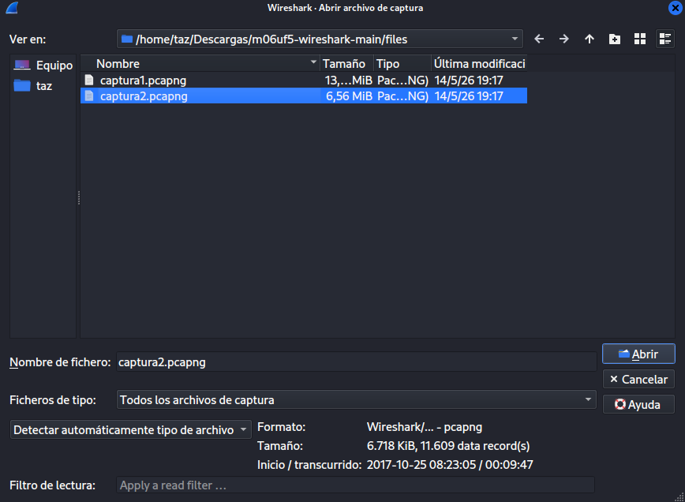

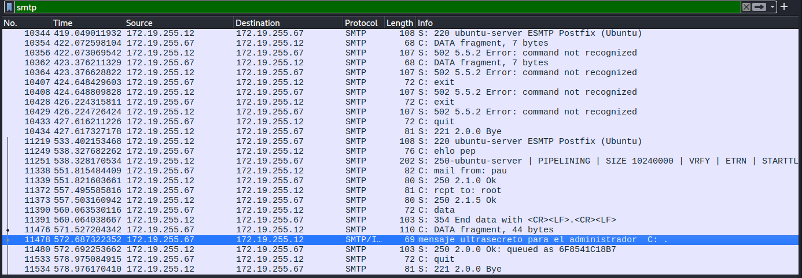

Fem clic dret sobre el paquet que conté el missatge → `Seguir → Flujo TCP`:

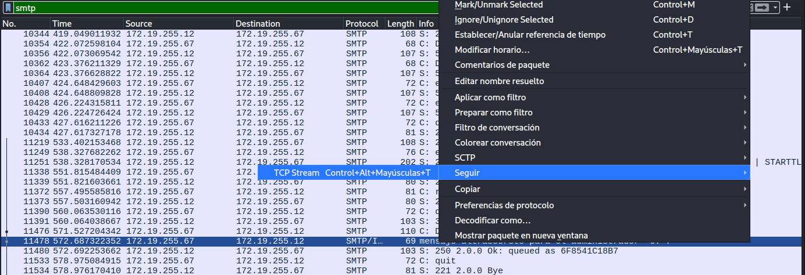

### Pregunta

S'ha enviat el següent correu:

- `Remitent:` pau
- `Destinatari:` root
- `Contingut del missatge:` mensaje ultrasecreto para el administrador
- `Servidor SMTP:` ubuntu-server (Postfix)

Podem veure el contingut complet del correu en text clar:

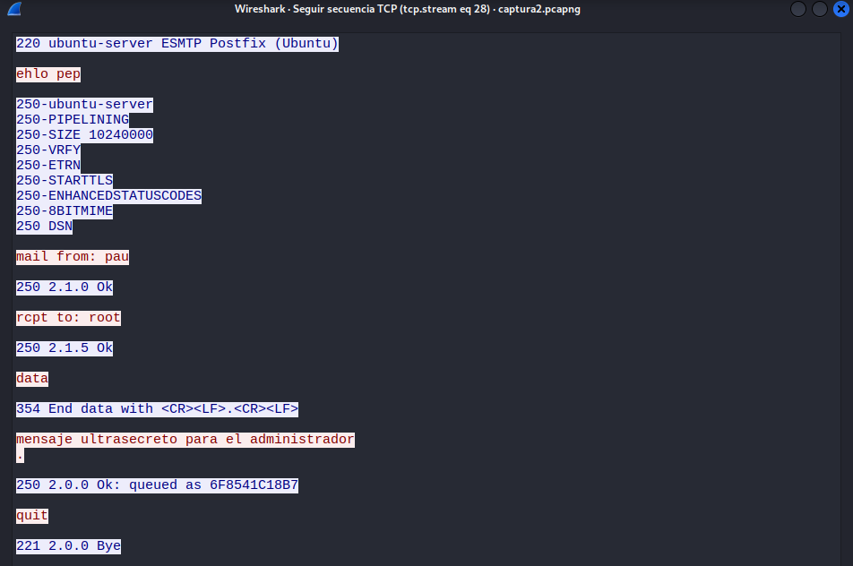

```
220 ubuntu-server ESMTP Postfix (Ubuntu)

ehlo pep

250-ubuntu-server
250-PIPELINING
250-SIZE 10240000
250-VRFY
250-ETRN
250-STARTTLS
250-ENHANCEDSTATUSCODES
250-8BITMIME
250 DSN

mail from: pau

250 2.1.0 Ok

rcpt to: root

250 2.1.5 Ok

data

354 End data with <CR><LF>.<CR><LF>

mensaje ultrasecreto para el administrador
.

250 2.0.0 Ok: queued as 6F8541C18B7

quit

221 2.0.0 Bye
```